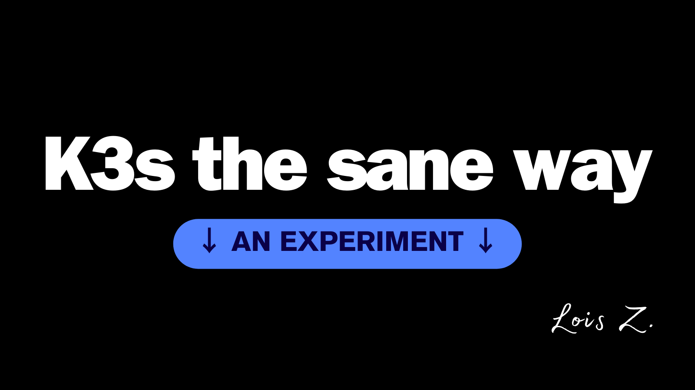

# K3S the sane way



## But Why?

#### The cost

Before I started this project, I had PlanetScale Scaler Pro, Vercel Teams, Fly.io, Railway...One night I realised the bills from Vercel alone was higher than my monthly grocery budget!!!

#### Latency

Let's say if I am making a web app for my own convenience, I might buy a server in the UK, and deploy both the app and database on the same server, it will load instantly for me, and the data traveling between server and database would be short.

But how about my friends in the US? In Asia? In Australia? I soon bought a server in Singapore to test it.

[Why slow?](http://www.stuartcheshire.org/rants/latency.html) It took me close to 38.2 seconds to wait for data to come back after I clicked on login. The speed test was run under a [full stack Golang project (the worse stack for frontend, amazing tool for backend, I won't say twice)](https://github.com/zmzlois/LinkGoGo), all server render, no hydration. This means the page will be blank until the data comes in unless I build separate handlers for specific components that need data.

If I find a service provider that gives me this level of latency, I am out (unless they are very pretty 👉🏻👈🏻).

#### Inspiration

I took inspiration from [Jeff Geerling's Raspberry Pi Cluster Project](https://www.jeffgeerling.com/blog/2020/raspberry-pi-cluster-episode-1-introduction-clusters) - if your stack can run under extreme conditions like the Rasberry Pi (ARM with 1GB RAM), you are golden. And you will learn a lot from running things on bare metal.

I stop thinking about distributed system, servers and their location but instead, I think about [the OS of our generation](https://www.oilshell.org/blog/2021/07/blog-backlog-2.html) -- Kubernetes to handle the complexity and separation of servers. Stripping down the distance, and physicality of servers, merging them as one. The Unix of distributed operation system excites me.

**I know what I want. I can't afford EKS by myself. I want a deployment strategy that's optimised no matter how extreme the condition is. I can't guarantee `the experience on the edge` with milliseconds of cold start-- the best I can do is a server close enough to my friends and the shortest distance between server and database.**

Let the fiber handle the rest. I pray.

#### What I want at the end...

- [GEO DNS](https://blogs.manageengine.com/clouddns/2022/11/08/how-does-geodns-work.html): based on the requested user's location I route them to a server that's closest to them.
- [Application replication](https://kubernetes.io/docs/tasks/run-application/run-replicated-stateful-application/#cloning-existing-data): I don't want to only have one database on one server. I want every server to have a replica of the same database. Each server might have multiple databases for different applications. Each server should also have replicas of the same applications.
- [Node Affinity](https://kubernetes.io/docs/concepts/scheduling-eviction/assign-pod-node/#affinity-and-anti-affinity): Each application in the same node should only talk to the database in the same node to allow the best speed. The communication happens within the node but not outside.

I bought 4 servers from a cloud provider around the world: London, Frankfurt, Seattle and Singapore. It's not the managed services from GKE or EKS that help you manage your Kubernetes cluster -- the only thing that came with them was the fact that they were booted with Debian 12.

## What's included

Currently:

- [Prometheus](https://prometheus.io/) & [Grafana dashboard](https://grafana.com/): we install it via the community version [kube-prometheus-stack](https://github.com/prometheus-community/helm-charts/blob/main/charts/kube-prometheus-stack/values.yaml) it will come with every necessity baked in.
- Traefik

Todo:

- I did something messed up - I forgot to disable Traefik on k3s' initial installation. So now I need to figure out how to reconfigure it for reverse proxy and certs for applications.
- Cert Manager
- Longhorn
- BullMQ
- ...?

## Provisioning

### Step 1: Configure K3s cluster

To provision all servers

```bash
ansible-playbook playbook/site.yml
```

To reset all servers

```bash
ansible-playbook playbook/reboot.yml
```

After k3s is installed on the master run:

```bash
scp root@<master-ip>:~/.kube/config ~/.kube/config-ctb-london
```

Edit the `~/.kube/config-ctb-london` server address to the master node's address

And then set it as environment variable as:

```bash
export KUBECONFIG=~/.kube/config-ctb-london
```

We can check all the nodes and roles by running 

```bash
kubectl get nodes -o wide
```

### Step 2: Prometheus

I did something messed up on my first attempt: I forgot to make sure all pods from this stack should be on the same node. It had the database in Frankfurt, alert manager in Seattle and Grafana in Singapore. So I walked the [ConfigSet](./helm/prometheus/value.yml) and reassigned all nodes to London [via the easiest way](https://kubernetes.io/docs/concepts/scheduling-eviction/assign-pod-node/#nodeselector). I found the label I need for London node from OpenLens (OpenLens good).

1. Run

```bash
ansible-playbook helm/prereq.yml
```

to ensure helm is installed and if it is the latest version.

2. Install Prometheus and Grafana stack

In the [prometheus install play](./helm/prometheus/install.yml), using ansible's built-in helm module to install helm chart.

To learn more about the relationship between nodes, pods, and their relationships, look at [taint and toleration](https://kubernetes.io/docs/concepts/scheduling-eviction/taint-and-toleration/#:~:text=Tolerations%20allow%20the%20scheduler%20to,not%20scheduled%20onto%20inappropriate%20nodes.) and [node affinity - assigning pods to nodes](https://kubernetes.io/docs/concepts/scheduling-eviction/assign-pod-node/#affinity-and-anti-affinity) on kubernetes documentation.

Run

```bash
ansible-playbook helm/prometheus/install.yml -vvv
```

:::tips
use `-vvv` for VERY VERBOSE DEBUG MODE
:::

Check it health by running

```bash
kubectl --namespace monitoring get pods
```

Visit https://github.com/prometheus-operator/kube-prometheus for instructions on how to create & configure Alertmanager and Prometheus instances using the Operator.

After installing Prometheus and Grafana, remember to install openlens on the local computer to monitor the cluster by

```bash
brew install openlens
```

After installing openlens remember to add a plugin on openlens `@alebcay/openlens-node-pod-menu`

OpenLens will allow you to enter pods' terminal (imagine `docker exec -it <mycontainer> bash`) and monitor their health without getting cancer. Be careful of what the plugin can do it might terminate a pod.

For services that are deployed to kubernetes, without active deployment you can access their dashboard via port forwarding on openlens.

### Step 3: Reconfigure default Traefik

**Current Available dashboard**

- Prometheus alert manager
- Grafana

### Appreciation

Without the help, discussion with my friends [Anna](https://github.com/TheDevMinerTV) and [Martin](https://github.com/kerwanp) this project wouldn't have started. Also thank Rancher's [k3s-ansible](https://github.com/k3s-io/k3s-ansible) project and [Jeff's pip role](https://github.com/geerlingguy/ansible-role-pip).
